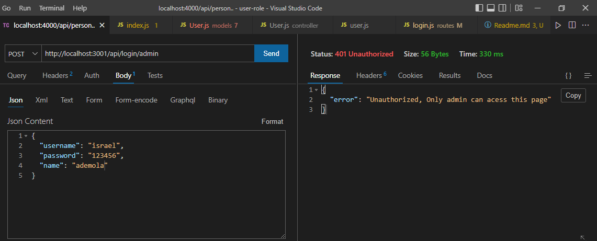

# User Authentication and Management
A user management for user-roles such as admin, user, staff and manager.

## Screenshots

A user with admin role can login to the system through the admin login route.


A user with no admin role cannot login to the system through the admin login route.



### Prerequisite

The setups steps expect following tools installed on the system.

* NodeJS
* MongoDB account


## 3. Install dependencies

```shell
npm install
```

## Built With

* NodeJS
* ExpressJS
* MongoDB

👤 **Author **

* GitHub: [@Ademola101](https://github.com/Ademola101)
* Twitter: [@ademola_isr](https://twitter.com/ademola_isr)
* LinkedIn: [Ademola Ogunmokun](https://linkedin.com/in/ademola-ogunmokun-492575203)

## 🤝 Contributing

Contributions, issues, and feature requests are welcome!

Feel free to check the [issues page](https://github.com/Ademola101/Todo-Api/issues).

## Show your support

Give a ⭐️ if you like this project!
